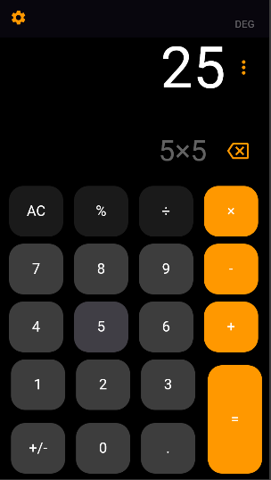

### Calculator App Features
- Basic Operations: Supports addition, subtraction, multiplication, and division.
- Decimal Support: Handles calculations with floating-point numbers.
- Responsive Design: Adapts seamlessly to different screen sizes and orientations.
- User-Friendly Interface: Designed with a focus on ease of use and accessibility.
- Error Handling: Includes built-in checks to handle invalid inputs gracefully.

